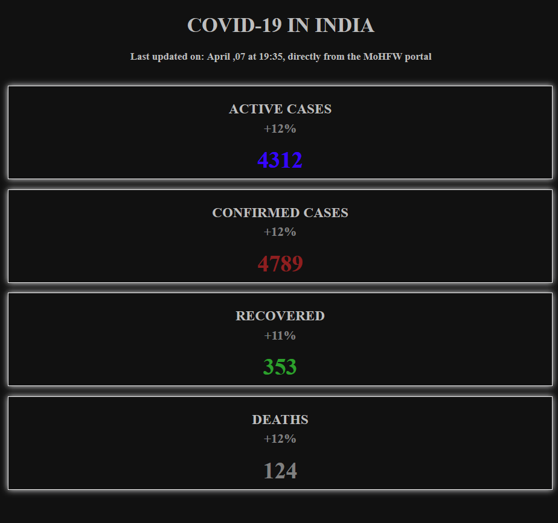
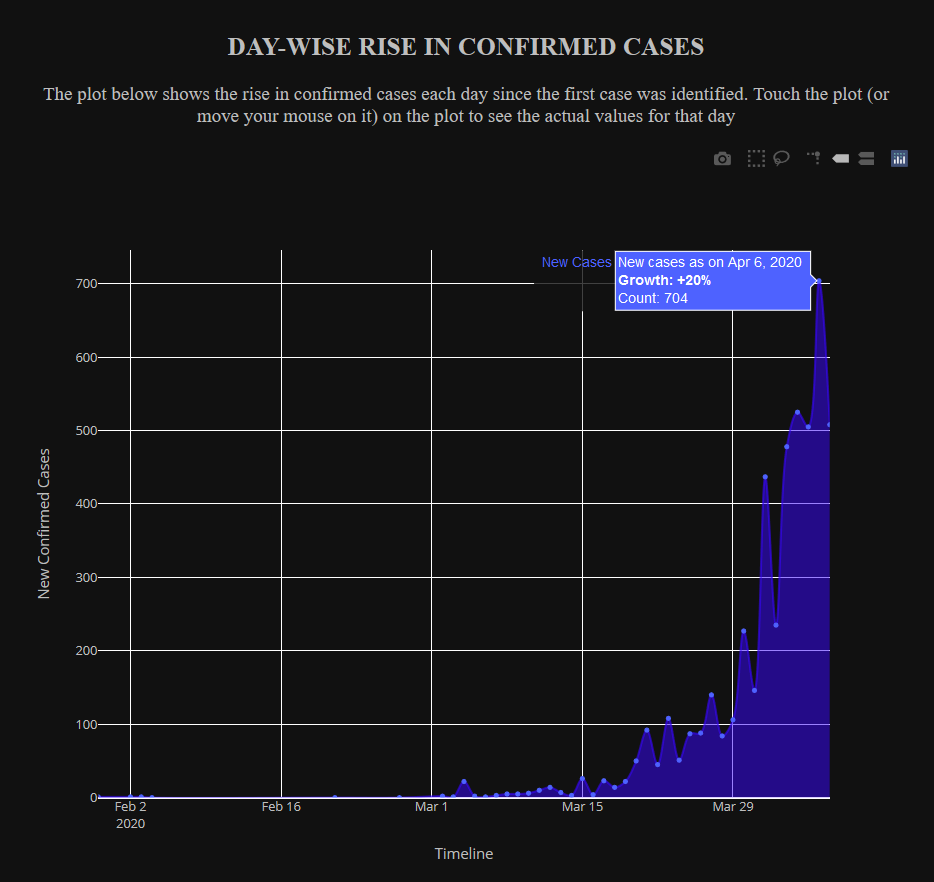
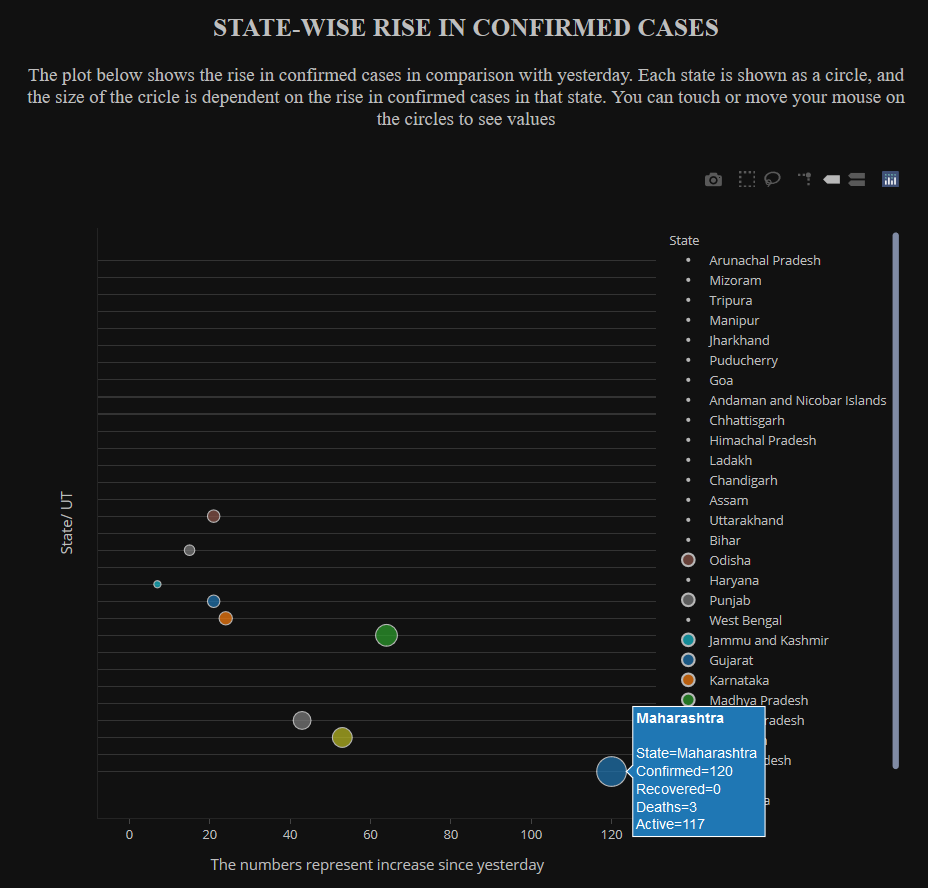
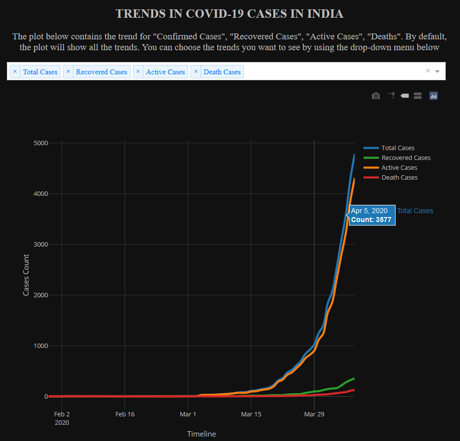
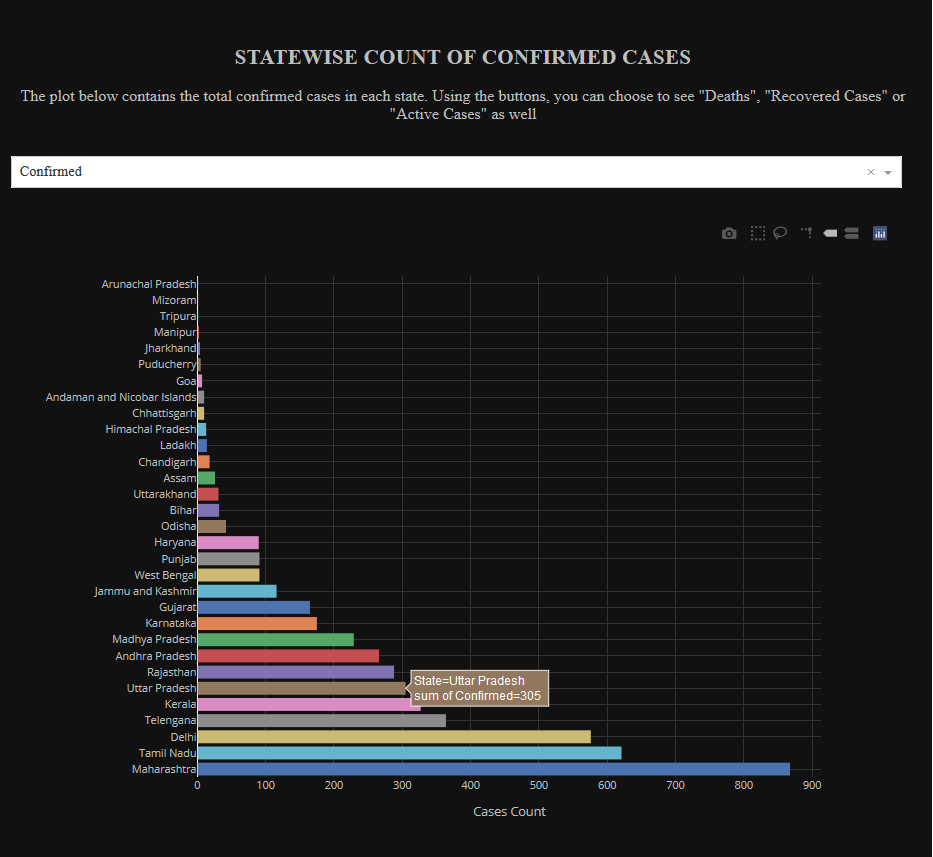

# Covid19-India

A web dashboard to analyse and visualize the COVID-19 pandemic in India deployed on Heroku at [https://covid19india1.herokuapp.com/](https://covid19india1.herokuapp.com/)
Built using Python and [Dash](https://dash.plot.ly/) by ploltly, with charts made in [Plotly](https://plot.ly/) and [Plolty express](https://plotly.com/python/plotly-express/)

---
The data used is directly from the Government of India's portal [https://www.mohfw.gov.in/index.html](https://www.mohfw.gov.in/index.html) which gets updated twice daily and henceforth automatically updates the dashboard.

The dashboard has six major sections.
 
 ## The latest updates
 Four tiles at the top that display the latest rise in Total Confirmed, Active, Recovered and Death cases along with the rise from the previous day in India.
 
 
 ## Day-wise rise in confirmed cases
 A Plot showing day wise rise in confirmed cases each day since the first case was identified in India. It is easy to interact with and gain insights.
 
 
 ## State- wise rise in confirmed cases
The plot shows the rise in confirmed cases in comparison with yesterday. Each state is shown as a circle, and the size of the cricle is dependent on the rise in confirmed cases in that state. You can touch or move your mouse on the circles to see values.

## Trends in the cases
The plot contains the trend for "Confirmed Cases", "Recovered Cases", "Active Cases", "Deaths". By default, the plot will show all the trends. You can choose the trends you want to see by using the drop-down menu below.

## State-wise count of cases
The plot contains the total confirmed cases in each state. Using the buttons, you can choose to see "Deaths", "Recovered Cases" or "Active Cases" as well.

 
